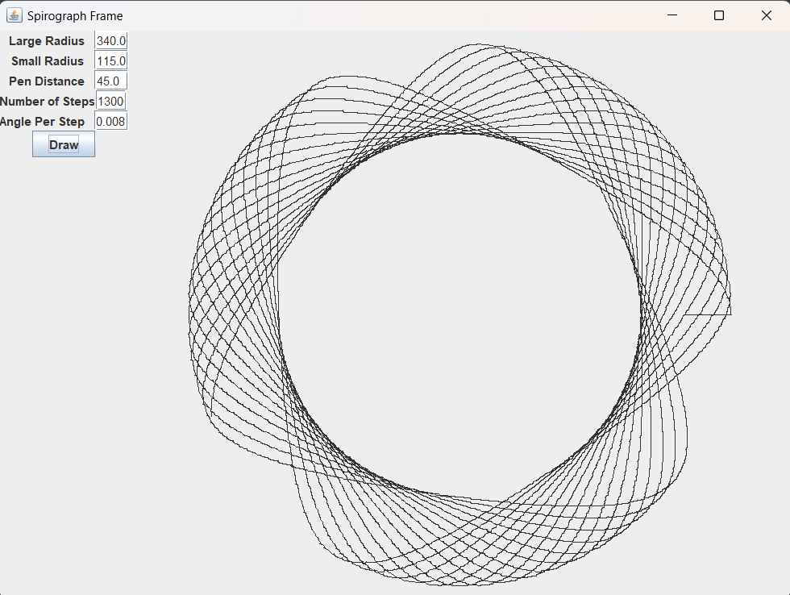

### Spirograph

Generates a spirograph, performing calculations based on radius of larger circle,
radius of smaller circle, pen distance, number of steps, and angle per step.
The spirograph picture changes based on user input for these five fields.

### Screenshots

#### Links

- [JUnit](https://junit.org/)
- [Mockito](https://site.mockito.org/)
- [GridBagLayout](https://docs.oracle.com/javase/8/docs/api/java/awt/GridBagLayout.html)